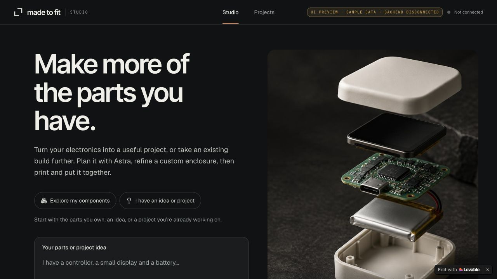
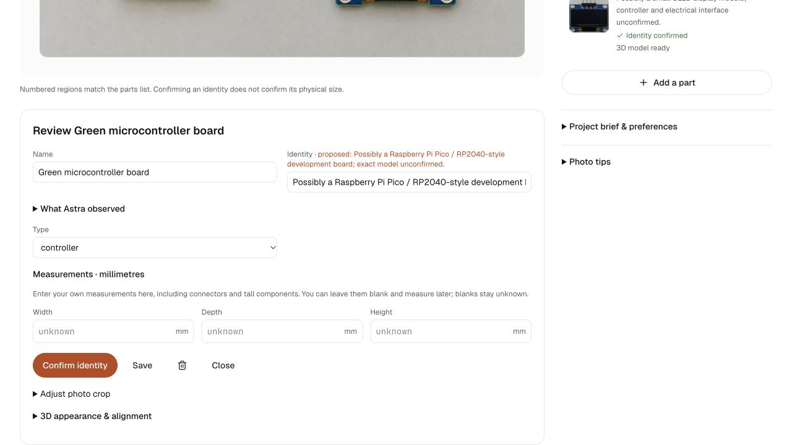
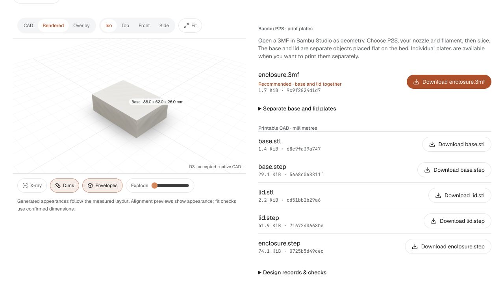

# Made to Fit

Made to Fit turns the electronics you already own into a project you can build. Upload photos or describe your parts, review Astra's suggestions, enter real measurements, and refine a custom enclosure. Inspect the 3D layout and geometry checks, accept a design revision, then download its print files and review the assembly guidance.

**[Open the live site](https://made-to-fit-astra-hack.lovable.app/)** · [Demo workflow and filming script](docs/DEMO-FILMING.md)

The Lovable site currently runs the explicitly labelled sample preview. The Python backend runs locally; Astra analysis, native CAD builds and real downloads require a connected backend. See [Run locally](#run-locally) to try the full workflow.

## How it works

1. **Review your parts.** Upload photos, describe your inventory or add parts manually. Review proposed identities and crops.
2. **Choose a project.** Explore Astra's project suggestions or develop an existing idea, including extra hardware and unresolved decisions.
3. **Measure your hardware.** Enter and confirm width, depth and height in millimetres. Unknown dimensions remain unknown; a photo does not establish physical size.
4. **Build and check.** Generate native CAD, inspect the layout and geometry checks, and refine the enclosure before accepting a revision.
5. **Print and assemble.** Download STEP, STL or Bambu P2S 3MF files for the accepted revision, then review the matching assembly guidance.

## Screenshots

**Live Studio landing page** — choose whether to start with components or an existing project idea. The public preview shows its backend-disconnected status.



**Part review and measurements** — review a photographed component and enter its envelope dimensions directly. Captured with the local backend connected.



**CAD and print files** — accepted native CAD revision R3 with actual 3MF, STL and STEP downloads. This local verification project uses synthetic dimensions; it is separate from the photographed-parts demo.



## Architecture

Lovable frontend with a Python/FastAPI backend for reviewed hardware inventories, Astra discovery, native CadQuery assemblies and immutable checked revisions.

## Run locally

Frontend requires Node/Bun. Backend requires Python 3.12 and `uv`.

```sh
bun install --frozen-lockfile
cp .env.example .env.local
bun run dev --host 127.0.0.1 --port 5173
```

In a second terminal:

```sh
cd backend
uv sync --frozen
cp .env.example .env
uv run uvicorn app.main:app --host 127.0.0.1 --port 8001
```

Frontend: http://127.0.0.1:5173. API: http://127.0.0.1:8001. API documentation: http://127.0.0.1:8001/docs.

Configure `OPENAI_API_KEY` and `HYPER3D_API_KEY` only in `backend/.env`. CAD and manual review work without these providers. The frontend receives only `VITE_API_BASE_URL`. Leave it unset for the explicitly labelled fixture preview; live request failures never become sample successes.

`backend/.data/` holds SQLite records, uploaded photos, generated CAD artifacts and provider jobs. Preserve it when restarting or deploying. Runtime files, databases, keys and virtual environments are ignored by Git.

## Working flows

- Shared idea/discovery intake, manual parts, normalized photo uploads and editable crop review.
- Persistent Astra thread, text-inventory proposals, grounded concepts and stale-selection checks.
- Source evidence proposals with explicit applicability/acceptance; unknown measurements stay null.
- Frozen CAD candidates, real build jobs, computed conflicts, preserved locks and explicit acceptance.
- CAD/Rendered/Overlay use the same backend tessellation, poses and independent part IDs. Camera, hide/isolate, explode and X-ray are display state.
- P2S geometry-only 3MF (combined plate and individual parts), per-part STEP/STL, assembled STEP and frozen design/check/source/print-layout records are downloadable only for the current real accepted revision.
- New candidates without an explicit printer volume target the Bambu P2S: 256 × 256 × 256 mm. Configurable removable locating lip and side fit clearance; the 3MF turns the lid over so its slab faces the bed.
- Persistent job elapsed times and stages, observed duration ranges for comparable completed jobs, and honest ETA availability/overrun states. Rodin timing samples match tier and detail.
- Explicit paid component reference jobs (standard 10k / detailed 20k requested faces), stored GLB assets and illustrative calibration review. Confirmed dimensions enable a suggested rigid orientation and uniform fit preview; approval binds calibration to those dimensions. Rendered mode uses the reviewed appearance, while checks remain envelope-based.
- Previous failures remain in task history; current failures appear in their own workflow. A later successful lookup clears the stale lookup error from the active review.

Open a 3MF in Bambu Studio as geometry, choose the P2S nozzle/filament/process settings, and slice before printing. The native Bambu Studio importer has been verified; no G-code or printer commands are sent by this app. Bed exclusions, brim/support space and physical lid fit require slicer/test-print review.

The mechanical checks do not establish electrical, thermal, strength, closure or slicer safety. Synthetic CAD regression dimensions are labelled as synthetic; their geometry and files are generated by native CAD.

## Verify

```sh
bun run test
bunx tsc --noEmit
bun run build
cd backend
uv run pytest -q
uv run ruff check app tests
```

For an isolated live CAD regression, run `python -m scripts.demo_fixture` from `backend/` with a configured API endpoint. This writes only local proof records and makes no provider calls. See [CONTINUITY.md](CONTINUITY.md) for the verified checkpoint and [docs/FRONTEND-INTEGRATION.md](docs/FRONTEND-INTEGRATION.md) for transport/coordinate details.

## Hosted frontend

Lovable synchronizes commits on `main`. A hosted browser needs an HTTPS-reachable Python backend and an exact `ALLOWED_ORIGINS` entry matching the hosted frontend origin. Set the hosted `VITE_API_BASE_URL` to that endpoint. Committing `backend/` does not run Python on Lovable. Local URLs reach this laptop only.

Preserve published Git history; never force-push or rewrite Lovable commits.
